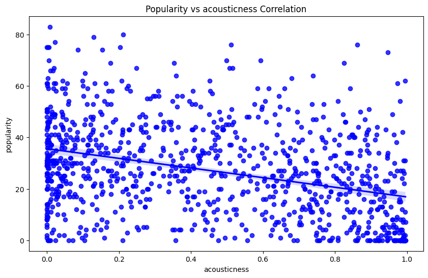
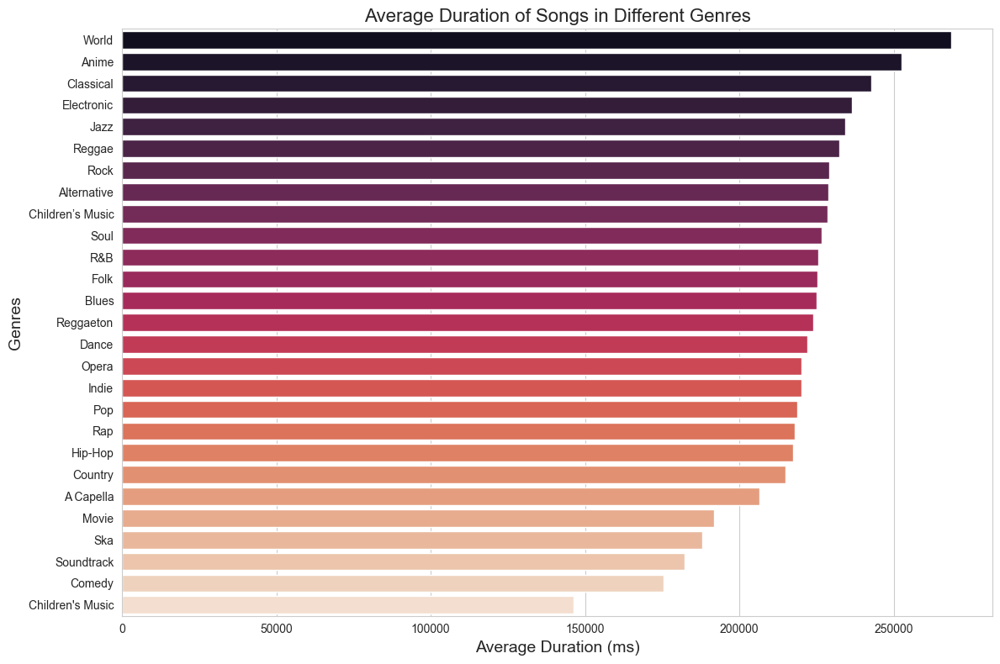
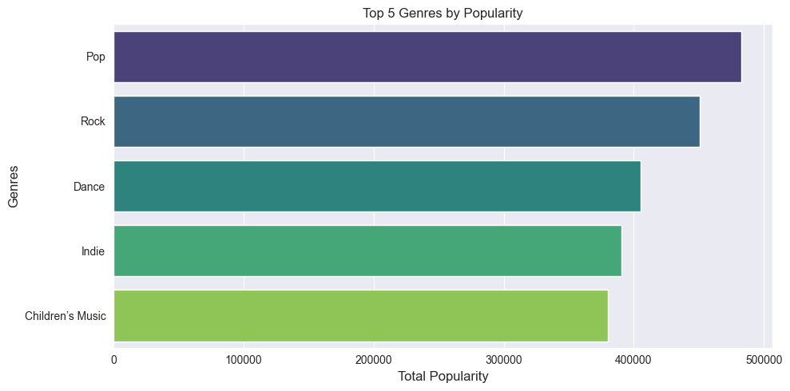
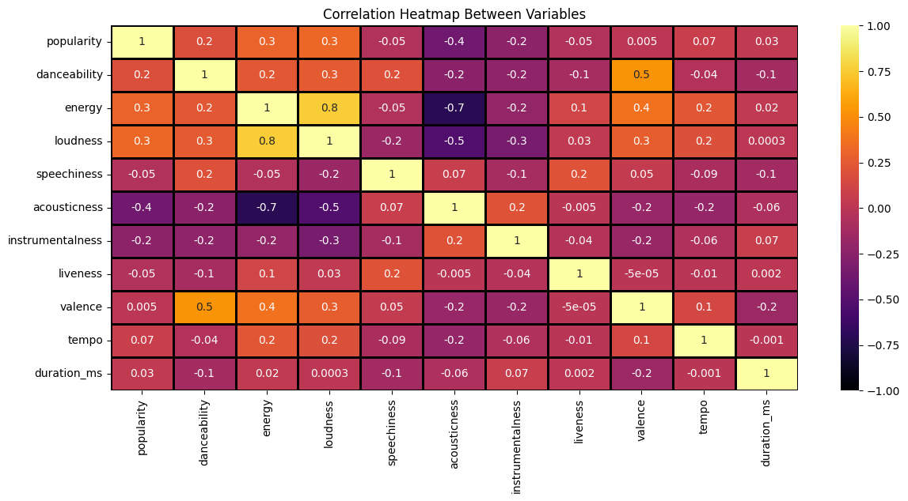

# Spotify Data Analysis

## Objective
The primary objective of this project is to analyze Spotify data to understand music trends, artist performance, genre characteristics, and song popularity. This analysis provides insights into patterns of music consumption and helps identify key factors contributing to the success of songs and artists.

## Project Overview
This project leverages Spotify data to derive actionable insights into music trends, artist performance, genre characteristics, and song popularity. Utilizing Python and industry-standard data analysis tools, the project delivers comprehensive visualizations and statistical analyses to understand patterns in music consumption.

## Key Features
- **Exploratory Data Analysis (EDA):** Examine metrics such as popularity, song duration, tempo, and more.
- **Data Visualization:** Create informative plots to uncover trends and patterns.
- **Genre Analysis:** Investigate the attributes that define popular genres.
- **Artist and Song Insights:** Identify top-performing artists and songs based on key metrics.

## Tools and Technologies Used
- **Development Environment:** Jupyter Notebook
- **Programming Language:** Python
- **Libraries:**
  - `pandas` for data manipulation
  - `numpy` for numerical operations
  - `matplotlib` and `seaborn` for data visualization

## Graphs and Visualizations
The project generates several meaningful graphs to illustrate key insights, including:
- **The correlation between popularity and acousticness using a scatter plot with a regression line**  
  
  

- **The average song duration per genre:**  
  
  

- **The top 5 genres by total popularity:**  
  
  

- **Attribute Correlations:** Heatmaps showing relationships between song attributes such as tempo, duration, and popularity. 
  
  

## Installation and Setup
1. Clone the repository:
   ```bash
   git clone <repository-url>
   ```
2. Navigate to the project directory:
   ```bash
   cd spotify_data_analysis
   ```
3. Install the required dependencies:
   ```bash
   pip install -r requirements.txt
   ```

## How to Use
1. Launch the Jupyter Notebook:
   ```bash
   jupyter notebook Spotify_data_analysis.ipynb
   ```
2. Follow the sequential execution of notebook cells to replicate and explore the analysis.

## Project Outcomes
Key insights derived from the analysis include:
- Identification of popular genres and their defining characteristics.
- Visualization of trends in song popularity over time.
- Comprehensive summaries of song attributes such as tempo, duration, and loudness.

## Conclusion
This analysis provides a data-driven perspective on the music industry, highlighting the factors that drive popularity and success on Spotify. The insights obtained can guide music producers, marketers, and enthusiasts in making informed decisions based on trends and patterns revealed through data.

## Repository Structure
```
|-- Spotify_data_analysis.ipynb   # Primary analysis notebook
|-- requirements.txt              # Dependency list
|-- plots/                        # Folder for saved visualizations
```

## Contribution Guidelines
Contributions are encouraged! If you have ideas for enhancements or additional features, please open an issue or submit a pull request. Collaboration is welcomed.

## Acknowledgments
- Spotify for providing access to the data.
- The Python community for their robust libraries and support.

---

If you find this project valuable, please consider starring the repository!
